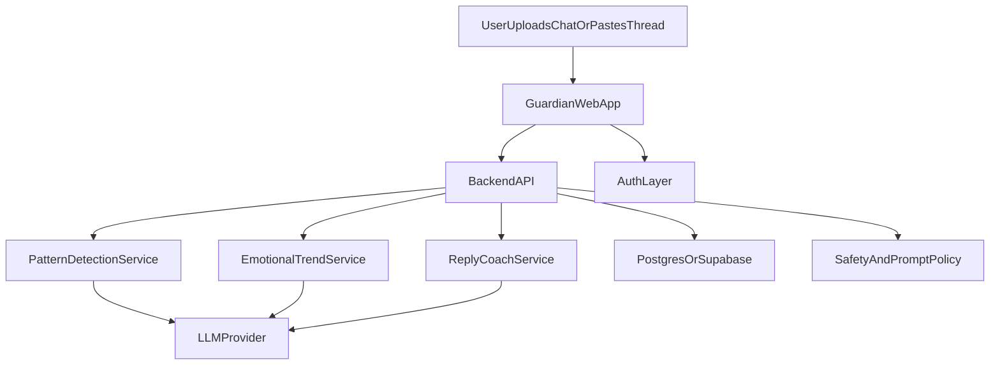

# Samsung Guardian: 

## Goal
Create a hackathon-ready product called **Samsung Guardian**: a web app that analyzes conversation text for manipulation patterns, tracks emotional trends over time, and offers a protective reply coach.

## Chosen Direction
- Platform: **Website** (fastest to build and demo)
- AI stack: **Managed LLM APIs** (best for beginner velocity)
- Submission sequence:
  - Phase 1: **Solution blueprint submission**
  - Phase 2: **Full solution submission**

## Phase 1: Solution Blueprint Submission (Pitch-first)

### 1) Define Product Framing for Samsung
- Position as: "A relationship safety intelligence layer for Samsung Messages."
- Explain why Samsung is unique:
  - Samsung Messages distribution
  - On-device privacy future path
  - Potential One UI integration surface (reply suggestions, warning chips, wellbeing insights)

### 2) Finalize MVP Scope (for demo)
- Feature A: Manipulation pattern detection
  - Labels: Gaslighting, Love Bombing, Guilt-tripping, Silent Treatment
  - Output: Label + confidence + plain-language explanation
- Feature B: Emotional trend timeline
  - Track sentiment/self-doubt signals across uploaded conversations over time
  - Output: visual trend and warning changes
- Feature C: Reply coach
  - Input: user raw reply draft
  - Output: safer rewrite preserving user tone + boundary-focused alternatives

### 3) Build Hackathon Narrative
- Problem: emotional manipulation in everyday messaging is hard to identify in real time
- Why now: LLMs can interpret context, not just keywords
- Why Samsung: can ship as an ecosystem-native trust feature
- Impact metrics to include in deck:
  - Detection precision on curated examples
  - Reduction in "escalating" replies after coaching
  - User confidence score improvement (post-session)

### 4) Prepare Blueprint Deliverables
- 8-12 slide deck:
  - Problem, users, solution, Samsung fit, architecture, privacy, demo flow, roadmap
- Architecture one-pager
- Demo script (2-3 min)
- Evaluation plan with benchmark dataset

### 5) Suggested Architecture Diagram (for slide)

## Phase 2: Full Solution Submission (Build in Cursor)

### 1) Tech Stack (Beginner-friendly)
- Frontend: Next.js + TypeScript + Tailwind
- Backend: Next.js API routes (single repo simplicity)
- DB: Supabase Postgres
- Auth: Supabase Auth (email magic link)
- AI: OpenAI/Anthropic API
- Charts: Recharts for trend visuals
- Deploy: Vercel

### 2) Product Screens to Build
- Landing page (problem + Samsung integration pitch)
- Dashboard
  - Conversation input (paste/upload .txt)
  - Detection results cards
  - Trend chart over time
- Reply coach panel
  - Raw reply input
  - Safer alternatives + rationale
- History page (saved analyses)
- Privacy page (what is stored, deletion controls)

### 3) Data Model (Minimal)
- users
- conversations
  - id, user_id, source_type, created_at
- messages
  - conversation_id, speaker, text, timestamp
- analyses
  - conversation_id, label_json, risk_score, explanation_json
- trend_snapshots
  - user_id, date, self_doubt_score, stress_score
- coached_replies
  - conversation_id, raw_reply, coached_reply, style_notes

### 4) AI Features Implementation Sequence
1. Prompt templates for detection labels and explanations
2. Structured JSON output schema validation
3. Trend extraction prompt to compute emotional signals per thread
4. Reply coach prompt with constraints:
   - preserve tone
   - avoid escalation
   - reinforce personal boundaries
5. Add confidence + fallback rules for unclear cases

### 5) Safety, Ethics, and Guardrails
- Show disclaimer: not legal/medical diagnosis
- Add crisis/help resources links
- Avoid definitive accusations in wording
- Human-in-the-loop language: "possible pattern" instead of absolute claims
- Data deletion button and private mode option

### 6) Cursor Workflow (How you execute)
- Step 1: Initialize Next.js app from terminal in Cursor
- Step 2: Build UI pages first with mock JSON
- Step 3: Add API routes and prompt templates
- Step 4: Connect Supabase DB and persistence
- Step 5: Replace mock data with real LLM calls
- Step 6: Add charts, loading states, error boundaries
- Step 7: Polish UX and run deployment

### 7) Demo Plan (Final Submission)
- Demo script sequence:
  1. Paste conversation
  2. Show detected manipulation patterns
  3. Show trend over past threads
  4. Enter emotional raw reply
  5. Show coached safer response
  6. End with Samsung integration roadmap slide

### 8) Samsung-specific Roadmap (Judging Advantage)
- Near-term: web prototype + Samsung Messages export/import simulation
- Mid-term: Android companion app with SMS permission-based import
- Future: Samsung Messages native feature proposal
  - Smart warning chips before send
  - One UI wellbeing dashboard card
  - On-device inference for privacy

## Success Criteria
- User can analyze at least one conversation end-to-end
- System returns clear pattern labels with explanations
- Trend chart updates across multiple sessions
- Reply coach produces safer alternatives in under 5 seconds
- Demo can run reliably on deployed URL
